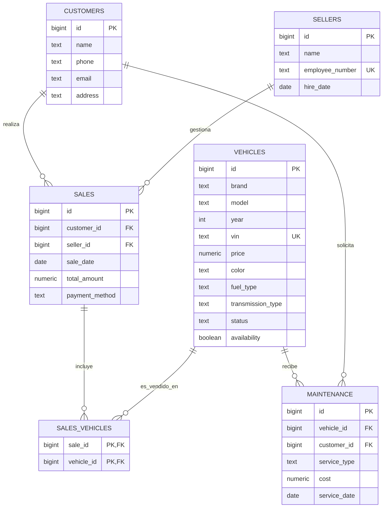

# Sistema de Gestión para Concesionario de Vehículos

## Descripción General

Este sistema de base de datos está diseñado para gestionar todas las operaciones de un concesionario de vehículos, permitiendo el registro y administración de vehículos en inventario, clientes, vendedores, transacciones de ventas y servicios de mantenimiento realizados.

## Diagrama Entidad-Relación

El siguiente diagrama muestra la estructura de la base de datos y las relaciones entre entidades:


También puede visualizarse en código Mermaid:



## Estructura de la Base de Datos

### Tablas Principales

#### 1. Vehículos (`vehicles`)
Almacena información detallada de todos los vehículos en el concesionario.

| Campo            | Tipo         | Descripción                                        |
|------------------|--------------|---------------------------------------------------|
| id               | bigint       | Identificador único, autogenerado                 |
| brand            | text         | Marca del vehículo                                |
| model            | text         | Modelo del vehículo                               |
| year             | int          | Año de fabricación                                |
| vin              | text         | Número de identificación del vehículo (único)     |
| price            | numeric      | Precio del vehículo                               |
| color            | text         | Color del vehículo                                |
| fuel_type        | text         | Tipo de combustible                               |
| transmission_type| text         | Tipo de transmisión                               |
| status           | text         | Estado ('new', 'used', 'not available')           |
| availability     | boolean      | Disponibilidad en inventario                      |

#### 2. Clientes (`customers`)
Registra la información de contacto de los clientes.

| Campo     | Tipo   | Descripción                   |
|-----------|--------|-------------------------------|
| id        | bigint | Identificador único, autogenerado |
| name      | text   | Nombre completo del cliente   |
| phone     | text   | Número telefónico             |
| email     | text   | Correo electrónico            |
| address   | text   | Dirección                     |

#### 3. Vendedores (`sellers`)
Almacena información sobre los vendedores del concesionario.

| Campo           | Tipo   | Descripción                       |
|-----------------|--------|-----------------------------------|
| id              | bigint | Identificador único, autogenerado |
| name            | text   | Nombre completo del vendedor      |
| employee_number | text   | Número de empleado (único)        |
| hire_date       | date   | Fecha de contratación             |

#### 4. Ventas (`sales`)
Registra las transacciones de venta realizadas.

| Campo         | Tipo        | Descripción                       |
|---------------|-------------|-----------------------------------|
| id            | bigint      | Identificador único, autogenerado |
| customer_id   | bigint (FK) | Cliente que realizó la compra     |
| seller_id     | bigint (FK) | Vendedor que procesó la venta     |
| sale_date     | date        | Fecha de la venta                 |
| total_amount  | numeric     | Monto total de la venta           |
| payment_method| text        | Método de pago                    |

#### 5. Relación Ventas-Vehículos (`sales_vehicles`)
Tabla de relación muchos a muchos entre ventas y vehículos.

| Campo       | Tipo        | Descripción                  |
|-------------|-------------|------------------------------|
| sale_id     | bigint (FK) | Identificador de la venta    |
| vehicle_id  | bigint (FK) | Identificador del vehículo   |

#### 6. Mantenimiento (`maintenance`)
Registra los servicios de mantenimiento realizados.

| Campo        | Tipo        | Descripción                       |
|--------------|-------------|-----------------------------------|
| id           | bigint      | Identificador único, autogenerado |
| vehicle_id   | bigint (FK) | Vehículo que recibió el servicio  |
| customer_id  | bigint (FK) | Cliente que solicitó el servicio  |
| service_type | text        | Tipo de servicio                  |
| cost         | numeric     | Costo del servicio                |
| service_date | date        | Fecha del servicio                |

## Justificación del Diseño

### Decisiones de Diseño

1. **Estructura Normalizada**: La base de datos está diseñada siguiendo los principios de normalización para reducir la redundancia y mejorar la integridad de los datos.

2. **Relación Muchos a Muchos para Ventas y Vehículos**: Se implementó una tabla intermedia (`sales_vehicles`) para representar la relación muchos a muchos entre ventas y vehículos, permitiendo que una venta pueda incluir múltiples vehículos y que un vehículo pueda estar asociado a diferentes ventas (aunque en la práctica, un vehículo normalmente sólo se vende una vez).

3. **Campos de Estado y Disponibilidad**: Para cumplir con el requisito de actualizar el estado de los vehículos vendidos, se incluyeron los campos `status` y `availability` en la tabla de vehículos.

4. **Mantenimiento Independiente**: La tabla de mantenimiento se diseñó para permitir registrar servicios tanto para vehículos vendidos (asociados a un cliente) como para vehículos aún en inventario (sin cliente asociado).

### Restricciones y Validaciones

1. **Claves Primarias**: Todas las tablas utilizan IDs auto-incrementables como claves primarias, excepto la tabla `sales_vehicles` que utiliza una clave primaria compuesta por `sale_id` y `vehicle_id`.

2. **Claves Foráneas**: 
   - `sales.customer_id` → `customers.id`
   - `sales.seller_id` → `sellers.id`
   - `sales_vehicles.sale_id` → `sales.id`
   - `sales_vehicles.vehicle_id` → `vehicles.id`
   - `maintenance.vehicle_id` → `vehicles.id`
   - `maintenance.customer_id` → `customers.id`

3. **Restricciones de Unicidad**:
   - `vehicles.vin`: Garantiza que cada vehículo tenga un VIN único
   - `sellers.employee_number`: Asegura que cada vendedor tenga un número de empleado único

4. **Restricciones de Verificación**:
   - `vehicles.status`: Solo puede tomar los valores 'new', 'used', o 'not available'

### Automatización de Procesos

Se implementó un trigger (`after_sale_insert`) que se activa después de insertar un registro en la tabla `sales_vehicles`, actualizando automáticamente el estado y la disponibilidad del vehículo vendido:

```sql
create or replace function update_vehicle_availability() returns trigger as $$
BEGIN
    UPDATE vehicles SET availability = false, status = 'not available' WHERE id = NEW.vehicle_id;
    RETURN NEW;
END;
$$ language plpgsql;

create trigger after_sale_insert
after insert on sales_vehicles for each row
execute function update_vehicle_availability();
```

## Relaciones entre Entidades

1. **Clientes y Ventas (1:N)**:
   - Un cliente puede realizar múltiples compras
   - Cada venta está asociada a un único cliente

2. **Vendedores y Ventas (1:N)**:
   - Un vendedor puede gestionar múltiples ventas
   - Cada venta es gestionada por un único vendedor

3. **Ventas y Vehículos (N:M)**:
   - Una venta puede incluir múltiples vehículos
   - Un vehículo podría estar asociado a múltiples ventas (aunque normalmente solo a una)
   - Esta relación se implementa mediante la tabla intermedia `sales_vehicles`

4. **Vehículos y Mantenimiento (1:N)**:
   - Un vehículo puede recibir múltiples servicios de mantenimiento
   - Cada servicio de mantenimiento está asociado a un único vehículo

5. **Clientes y Mantenimiento (1:N)**:
   - Un cliente puede solicitar múltiples servicios de mantenimiento
   - Cada servicio está asociado a un único cliente (o a ninguno si el vehículo aún no ha sido vendido)

## Implementación

El esquema SQL completo para crear esta base de datos es el siguiente:

```sql
create table vehicles (
  id bigint primary key generated always as identity,
  brand text not null,
  model text not null,
  year int not null,
  vin text not null unique,
  price numeric(10, 2) not null,
  color text not null,
  fuel_type text not null,
  transmission_type text not null,
  status text not null check (status in ('new', 'used', 'not available')),
  availability boolean not null default true
);

create table customers (
  id bigint primary key generated always as identity,
  name text not null,
  phone text not null,
  email text not null,
  address text not null
);

create table sellers (
  id bigint primary key generated always as identity,
  name text not null,
  employee_number text not null unique,
  hire_date date not null
);

create table sales (
  id bigint primary key generated always as identity,
  customer_id bigint references customers (id),
  seller_id bigint references sellers (id),
  sale_date date not null,
  total_amount numeric(10, 2) not null,
  payment_method text not null
);

create table sales_vehicles (
  sale_id bigint references sales (id),
  vehicle_id bigint references vehicles (id),
  primary key (sale_id, vehicle_id)
);

create table maintenance (
  id bigint primary key generated always as identity,
  vehicle_id bigint references vehicles (id),
  customer_id bigint references customers (id),
  service_type text not null,
  cost numeric(10, 2) not null,
  service_date date not null
);

create or replace function update_vehicle_availability() returns trigger as $$
BEGIN
    UPDATE vehicles SET availability = false, status = 'not available' WHERE id = NEW.vehicle_id;
    RETURN NEW;
END;
$$ language plpgsql;

create trigger after_sale_insert
after insert on sales_vehicles for each row
execute function update_vehicle_availability();
```

## Uso del Sistema

Este sistema de base de datos permite:

1. Mantener un inventario actualizado de vehículos con información detallada
2. Registrar y gestionar información de clientes y vendedores
3. Registrar transacciones de venta con detalles de pago
4. Vincular ventas con clientes, vendedores y vehículos específicos
5. Registrar servicios de mantenimiento para vehículos
6. Actualizar automáticamente el estado de disponibilidad de los vehículos vendidos

## Mejoras Futuras

Algunas posibles mejoras para el sistema podrían incluir:

1. Historial de cambios de precios de vehículos
2. Sistema de comisiones para vendedores
3. Seguimiento de garantías para vehículos vendidos
4. Programación de servicios de mantenimiento
5. Estadísticas de ventas y rendimiento
